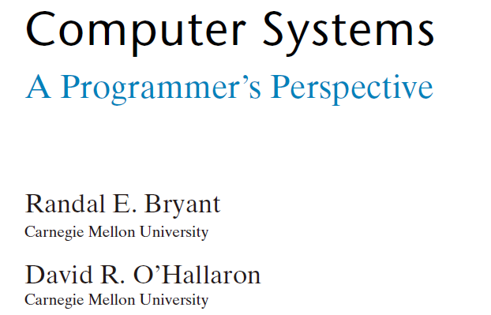

# Learning CSAPP
```这个计划仅仅是初步计划，详细时间线制定需要再等一段时间```
Computer Systems:A Programmer's Perspective(CSAPP)
深入理解计算机系统

+ Requirements:
  + Push your notes to GitHub repository in every period,
  + Finish assignments carefully,
  + Conduct labs independently,try to seek necessary help.
## Section 1:</br>Finish Part I and conduct 3~4 labs.(2~3 months)
**31.03.2023**
+ Pre-skills needed(1 week):
    + Markdown & Necessary skills of reading English books
    + Primary Linux skills
    + Primary Git & GitHub skills
    + Using VPN proxy
+ 
